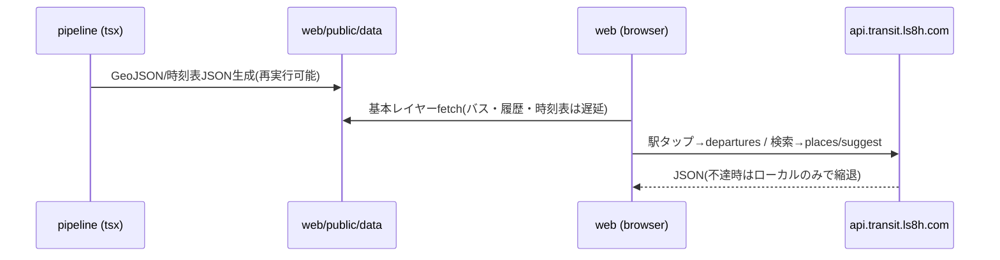

# Transit Japan 3D Design

## Overview

静的配信可能なWebアプリ(Vite+TypeScript+deck.gl+MapLibre GL)と、
オープンデータを取得・変換するNode(tsx)パイプラインの2パッケージ構成(npm workspaces)。
詳細な設計経緯は docs/superpowers/specs/2026-07-04-transit-japan-3d-design.md を参照。

## Architecture

### Components
- **pipeline/sources**: ダウンローダ(ksj=国土数値情報, gtfs-jp=GTFSリポジトリ537フィード, overpass=OSM)。全てキャッシュ+一時ファイル経由のアトミック書き込み
- **pipeline/build**: 変換スクリプト群(rail/rail-history/ferry/air/bus/ropeway/timetable)→ web/public/data/ へGeoJSON・時刻表JSONを出力
- **web/src/map.ts**: MapLibre基図(地理院淡色)+deck.gl MapboxOverlay
- **web/src/layers/transit.ts**: モード別レイヤー生成・時代フィルタ(メモ化)・遅延ロード(in-flight共有)
- **web/src/anim/vehicles.ts**: VehicleAnimator — 可変速クロック・viewport別時刻表ロード・trip補間
- **web/src/api/**: api.transit.ls8h.com クライアント(openapi-typescript生成型) — 発車標・場所検索
- **web/src/ui/**: HUDパネル(blueprintデザイン)・ツールチップ(XSS安全)

### Data Flow



## Data Models

```typescript
// 線: { n: 路線名, op: 事業者, mode: RailMode|"bus"|"ferry"|"air"|"ropeway" }
// 点: { stn: 駅/停留所/空港名, n, op, mode }
// 履歴: 上記 + { from: 開始年, to: 終了年|null(現役) }
// 時刻表(tt/<feed>.json): { op, trips: [路線名, route_type, [sec,lon,lat][]][] }
```

## API Design (api.transit.ls8h.com 連携)

| Method | Endpoint | 用途 |
|---|---|---|
| GET | /api/v1/places/suggest?q= | 検索ボックスのサジェスト |
| GET | /api/v1/stations/{id} | 駅詳細 |
| GET | /api/v1/stations/{id}/departures | 発車標(列車愛称含む) |
| GET | /api/v1/map/3d-scene | 3D建物シーン(将来) |

## Error Handling
- データ欠損: レイヤー単位で縮退、HUDパネルに欠損名を表示
- API不達: 発車標・検索を非表示化しローカル機能は継続
- パイプライン: フィード単位でskip+警告ログ、中断はアトミック書き込みで再試行可能

## Security Considerations
- 外部由来文字列はtextContentで描画(XSS対策)
- APIキーが必要なソース(ODPT)は .env で管理しコミットしない

## Testing Strategy
- Unit: vitest(pipeline: classify/csv/時刻変換)
- Integration: --limit N でのパイプラインスモーク実行
- E2E: chrome-devtools MCPでの目視+スクリーンショット検証(全国/東京/瀬戸内/過去年)
